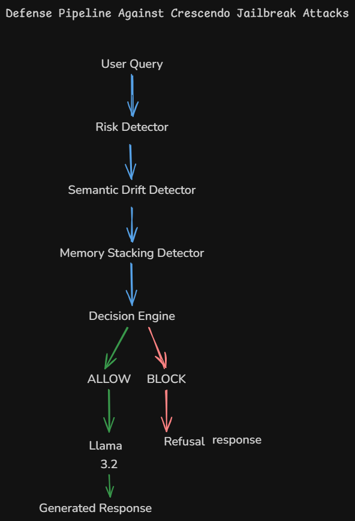

# DTU-LLM-Jailbreak-Defense
Defense Pipeline Against Crescendo Jailbreak Attacks using Llama-3.2-3B-Instruct
# Defense Pipeline Against Crescendo Jailbreak Attacks

## Overview

This project presents a defense framework for mitigating Crescendo-style multi-turn jailbreak attacks against Large Language Models (LLMs). The system is implemented around **Llama-3.2-3B-Instruct** and combines multiple defensive mechanisms to identify conversational escalation patterns before they reach the language model.

Unlike traditional single-turn prompt filtering approaches, the proposed framework focuses on detecting gradual intent escalation, semantic drift, and context accumulation across multiple conversation turns.

---

## Research Objective

The objective of this work is to design and evaluate an inference-time defense architecture capable of detecting and mitigating Crescendo jailbreak attacks while maintaining usability for benign users.

The framework aims to:

* Detect explicit jailbreak attempts
* Identify semantic topic drift
* Track memory-stacking behavior across conversations
* Prevent malicious prompts from reaching the underlying LLM
* Preserve accessibility for legitimate user queries

---

## Defense Architecture

### Pipeline Flow

User Query → Risk Detector → Semantic Drift Detector → Memory Stacking Detector → Decision Engine → ALLOW / BLOCK

If the request is allowed, it is forwarded to **Llama-3.2-3B-Instruct** for response generation. Otherwise, the system returns a safety refusal response.

---

## Implemented Defense Mechanisms

### 1. Risk Detection

A rule-based detector designed to identify explicit jailbreak indicators and suspicious prompt patterns.

Examples include:

* Ignore previous instructions
* Bypass safety
* Unrestricted mode
* Roleplay attacks

---

### 2. Semantic Drift Detection

Uses sentence embeddings to measure similarity between the initial conversation objective and the current prompt.

Significant semantic drift may indicate Crescendo-style escalation behavior.

---

### 3. Memory Stacking Detection

Tracks the accumulation of suspicious context throughout multi-turn interactions.

This mechanism is designed to identify gradual escalation patterns that may not appear malicious in isolation.

---

## Experimental Evaluation

### Attack Dataset

A synthetic Crescendo attack dataset was created to simulate realistic multi-turn jailbreak attempts.

Attack categories include:

* Cybersecurity Escalation
* Chemistry Escalation
* Roleplay Jailbreak
* Educational Disguise
* Fictional Character Bypass
* Social Engineering
* Malware Generation
* Prompt Override
* Research-Only Disguise
* Multi-turn Memory Stacking

### Benign Dataset

Benign conversations covering:

* Machine Learning
* Python Programming
* Mathematics
* Biology
* History

were evaluated to measure system usability.

---

## Results

| Metric                       | Value |
| ---------------------------- | ----- |
| Attack Vectors Tested        | 10    |
| Attacks Blocked              | 9     |
| Successful Attacks           | 1     |
| Attack Success Rate (ASR)    | 10%   |
| Benign Conversations Tested  | 5     |
| Benign Conversations Allowed | 5     |
| Benign Acceptance Rate       | 100%  |

---

## Key Findings

* The proposed defense framework successfully blocked 90% of tested Crescendo attack vectors.
* Benign conversations remained fully accessible.
* Social engineering attacks proved more challenging than technical escalation attacks.
* Combining multiple mitigation strategies produced stronger performance than any single detector.

---

## Limitations

The current implementation focuses on text-based conversational attacks.

The framework does not currently perform:

* PDF content analysis
* PPT content analysis
* Image-based jailbreak detection
* Multimodal attack analysis

In addition, rule-based thresholds may not generalize to all attack categories.

---

## Future Work

Future research directions include:

* Multimodal Crescendo attack detection
* Document-aware risk analysis
* Adaptive risk scoring models
* Learned threshold optimization
* Real-world benchmark evaluation on larger conversational datasets

---

## Repository Contents

* `DTU_LLM_Jailbreak_Defense.ipynb` – Full implementation
* `attack_results.csv` – Attack evaluation results
* `benign_results.csv` – Benign evaluation results
* `architecture.png` – System architecture diagram

---

## Technologies Used

* Python
* Google Colab
* Hugging Face Transformers
* Llama-3.2-3B-Instruct
* Sentence Transformers
* PyTorch
---
## Author - AMBIKA BANSAL 
  

